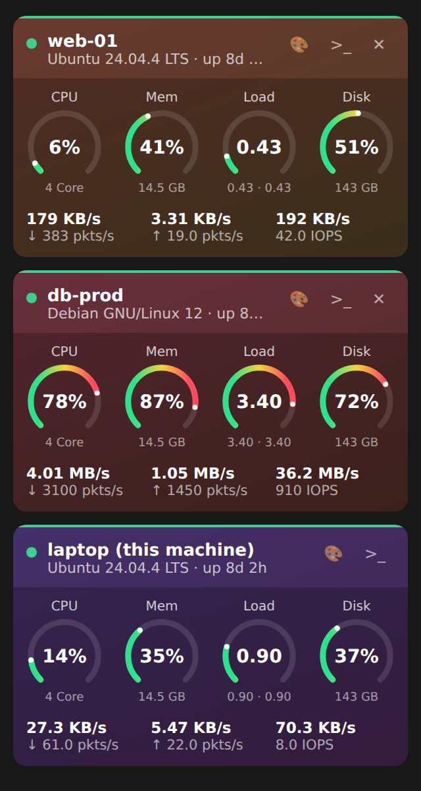
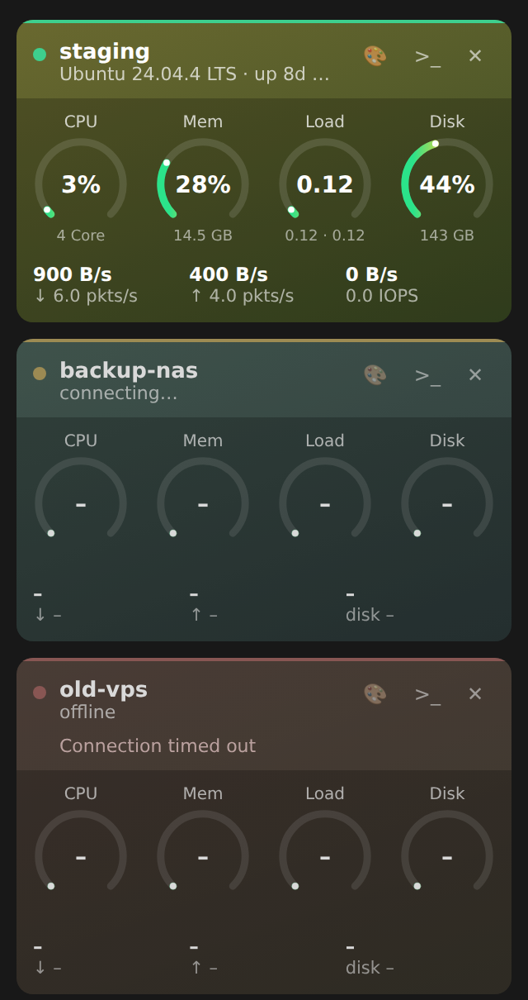
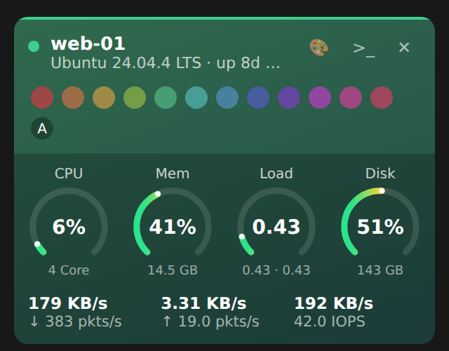

# Heimdall-SSH

Live stats for your SSH servers, right in the VS Code sidebar. Minimal, handy, no agent to install on the server.

Each server gets a card with:

- **CPU, Memory, Load, Disk** gauges (green → yellow → red)
- **Network** down/up speed and packets per second
- **Disk I/O** throughput and IOPS
- OS, uptime and latency, plus a status dot (connecting / online / error)
- A button to open an SSH terminal to that server
- A 🎨 button to give each machine its own colour (saved per machine; **A** resets to automatic)

The machine VS Code is running on is shown too, as the first card.

<p align="center">
  
</p>

## Install

Download `heimdall-ssh-x.y.z.vsix` from the [latest release](https://github.com/t7spotter/HEIMDALL-SSH/releases/latest) and run:

```sh
code --install-extension heimdall-ssh-x.y.z.vsix
```

Or use **Extensions → ⋯ → Install from VSIX…**. To update later, click the download icon in the panel title (or run **Heimdall-SSH: Check for Updates**). If a newer release exists it is downloaded and installed, and a **Reload Window** button appears.

### Screenshots

| Connection states | Pick a colour per machine |
| --- | --- |
|  |  |

## Getting started

1. Install the extension and click the **Heimdall-SSH** icon in the activity bar.
2. Hosts from `~/.ssh/config` appear automatically. Entries that only exist for git (`github.com`, `gitlab.com`, hosts with `User git`, ...) are skipped, and any other host that accepts your key but refuses to run a shell is detected on first connect and hidden automatically, with an **Undo** button. Click ✕ on a card to hide a host yourself; your config file is never modified. Edits to that file are picked up within a couple of seconds.
3. To add a server that isn't in your config, click **+** in the panel title and answer the prompts.

### Authentication

| Source | Method |
| --- | --- |
| `~/.ssh/config` host with `IdentityFile` | That key file |
| `~/.ssh/config` host without one | ssh-agent, then `~/.ssh/id_ed25519`, `id_ecdsa`, `id_rsa` |
| Added with **+** | ssh-agent / default keys, a key file, or a password |

Passwords are stored in VS Code's secret storage, never in settings. Passphrase-protected key files aren't supported directly; load them into ssh-agent.

### Host keys

The first time Heimdall connects to a server it remembers the host key. If the key later changes, the connection is refused. Run **Heimdall-SSH: Forget Saved Host Keys** if the change is expected.

## How it works

Heimdall keeps one SSH connection per server and, every few seconds, runs a single read-only script (`/proc` and `df` on Linux; `sysctl`, `vm_stat`, `netstat` and `iostat` on macOS). Rates (CPU, network, disk) come from the difference between two readings. Polling pauses while the panel is hidden, and dropped connections reconnect automatically.

Nothing is installed or left running on the server.

## Settings

| Setting | Default | Description |
| --- | --- | --- |
| `heimdall.refreshInterval` | `3` | Seconds between updates |
| `heimdall.servers` | `[]` | Extra servers (id, name, host, port, username, auth, keyPath) |

## Commands

- **Heimdall-SSH: Open ~/.ssh/config** (also the file icon in the panel title; creates a commented template if the file doesn't exist)
- **Heimdall-SSH: Check for Updates** (download icon in the panel title)
- **Heimdall-SSH: Show Hidden Hosts**
- **Heimdall-SSH: Add Server**
- **Heimdall-SSH: Reconnect All**
- **Heimdall-SSH: Forget Saved Host Keys**

## Limitations

- Monitored servers (and the local card) must be Linux or macOS. Windows servers aren't supported; the extension itself runs fine on Windows, macOS and Linux.
- On macOS, CPU is an approximation (summed process CPU ÷ cores) rather than a sampled total, and network counts only `en*` interfaces.
- `ProxyJump` and `Include` in `~/.ssh/config` aren't supported. Hosts behind a jump host will show a connection error, though the terminal button still works.
- In a Remote-SSH window, `~/.ssh/config` and "this machine" refer to the remote machine.

## Development

```sh
npm install
npm run build        # bundle with esbuild
npm run typecheck
```

Press **F5** to launch an Extension Development Host. To package and install locally:

```sh
npx vsce package --no-dependencies -o heimdall-ssh-0.1.5.vsix
code --install-extension heimdall-ssh-0.1.5.vsix --force
```

## License

MIT
